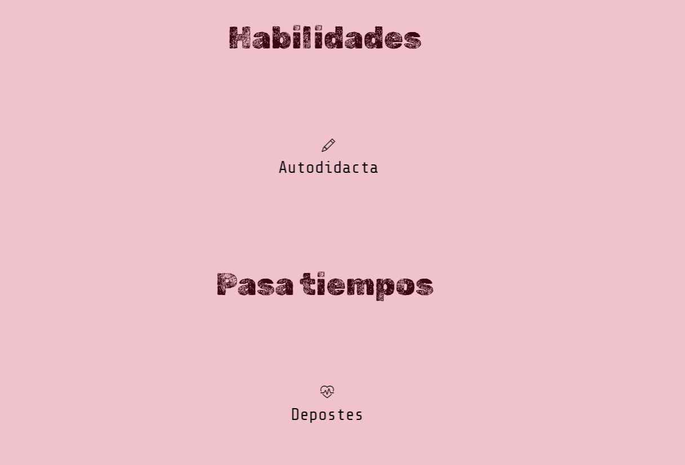

# Portafolio Adaptable 

Este proyecto creado para el bootcamp Tecnolochicas PRO, es una página web adaptable a dispositivos de distintos tamaños (este tipo de sitio web se conoce en inglés como "responsive"). 

El propósito de esta página web es mostrar el portafolio de proyectos personal. Incluye una descripción breve de mi perfil, experiencias, proyectos, cursos tomados, habilidades, pasa tiempos y formas de contacto. 

### Capturas de pantalla:

Primera parte de la página web:

Perfil:

Perfil y experiencia:

Proyectos:

Cursos tomados:

Habilidades y pasatiempos:

Contacto:

## Tecnologías

Esta página web fue creada con:

* HTML
* CSS
* JavaScript 
* Bootstrap 5

Además, se incluyeron **Google Fonts** para personalizar la fuente y **Bootstrap icons** para incorporar íconos como flechas y logos de redes sociales populares. 

## Español

El texto de la página web está escrito en español, al igual que las clases y atributos personalizados. 

